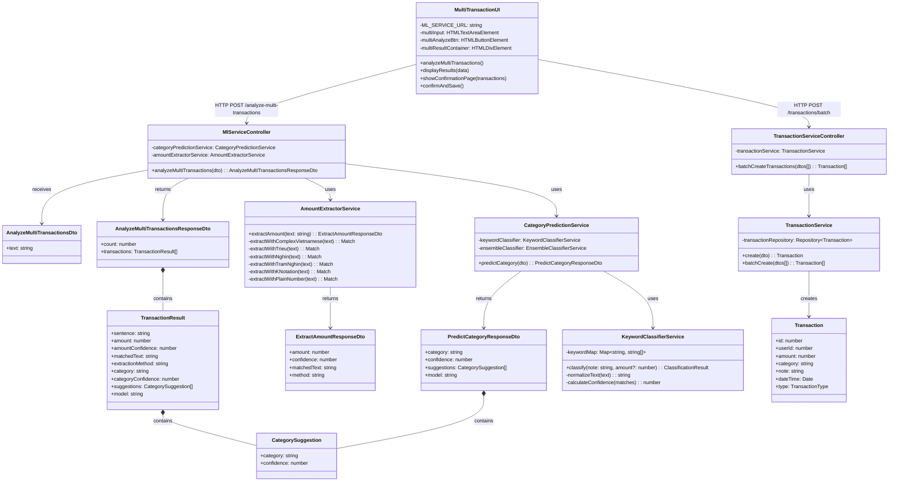
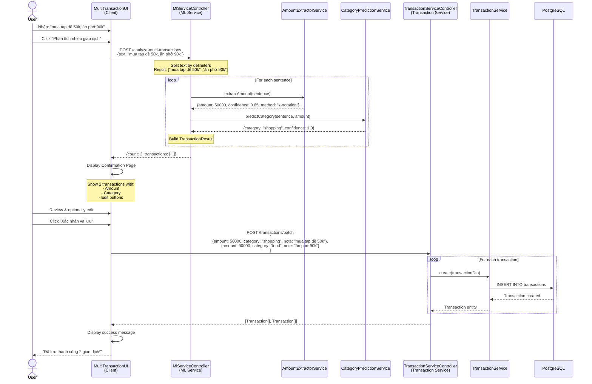

# Multi-Transaction Analysis - Class Diagram

## Tổng quan

Chức năng Multi-Transaction Analysis cho phép phân tích văn bản phức tạp chứa nhiều giao dịch, tách tự động và dự đoán category cho từng giao dịch.

## Kiến trúc 3 tầng

```
┌─────────────────────────────────────────────────────────────────┐
│                      CLIENT LAYER                                │
│  (HTML/JavaScript - test-ui hoặc Frontend App)                  │
└─────────────────────────────────────────────────────────────────┘
                              │
                              │ HTTP POST
                              │ /analyze-multi-transactions
                              ▼
┌─────────────────────────────────────────────────────────────────┐
│                    CONTROLLER LAYER                              │
│              (MlServiceController)                               │
└─────────────────────────────────────────────────────────────────┘
                              │
                              ├─────────────┐
                              ▼             ▼
┌────────────────────────────────┐  ┌──────────────────────────┐
│      SERVICE LAYER             │  │   SERVICE LAYER          │
│  AmountExtractorService        │  │ CategoryPredictionService│
└────────────────────────────────┘  └──────────────────────────┘
                              │
                              │ Return Results
                              ▼
┌─────────────────────────────────────────────────────────────────┐
│                      CLIENT LAYER                                │
│          Display Confirmation Page                               │
│               (User Reviews)                                     │
└─────────────────────────────────────────────────────────────────┘
                              │
                              │ User Confirms
                              ▼
┌─────────────────────────────────────────────────────────────────┐
│                 TRANSACTION SERVICE                              │
│         Batch Create Transactions in Database                   │
└─────────────────────────────────────────────────────────────────┘
```

---

## Class Diagram



---

## Sequence Diagram - Complete Flow



---

## Component Details

### 1. Client Layer (UI)

#### MultiTransactionUI (JavaScript)

```javascript
class MultiTransactionUI {
    constructor() {
        this.ML_SERVICE_URL = 'http://localhost:3005';
        this.TRANSACTION_SERVICE_URL = 'http://localhost:3001';
        this.currentAnalysis = null; // Store analysis results
    }

    // Phase 1: Analyze
    async analyzeMultiTransactions(text) {
        const response = await fetch(`${this.ML_SERVICE_URL}/analyze-multi-transactions`, {
            method: 'POST',
            headers: { 'Content-Type': 'application/json' },
            body: JSON.stringify({ text })
        });

        this.currentAnalysis = await response.json();
        this.displayResults(this.currentAnalysis);
    }

    // Phase 2: Show confirmation page
    displayResults(data) {
        const html = `
            <div class="confirmation-page">
                <h3>Tìm thấy ${data.count} giao dịch</h3>
                ${data.transactions.map((tx, i) => `
                    <div class="transaction-item" data-index="${i}">
                        <input type="text" class="edit-note" value="${tx.sentence}">
                        <input type="number" class="edit-amount" value="${tx.amount}">
                        <select class="edit-category">
                            <option value="${tx.category}" selected>${tx.category}</option>
                            <!-- Other categories -->
                        </select>
                        <span class="confidence">${(tx.categoryConfidence * 100).toFixed(0)}%</span>
                    </div>
                `).join('')}
                <button onclick="confirmAndSave()">Xác nhận và lưu</button>
            </div>
        `;
        this.multiResultContainer.innerHTML = html;
    }

    // Phase 3: Save to database
    async confirmAndSave() {
        // Collect edited data from form
        const transactions = this.collectEditedTransactions();

        // Call Transaction Service
        const response = await fetch(`${this.TRANSACTION_SERVICE_URL}/transactions/batch`, {
            method: 'POST',
            headers: {
                'Content-Type': 'application/json',
                'Authorization': `Bearer ${this.getAuthToken()}`
            },
            body: JSON.stringify(transactions)
        });

        const result = await response.json();
        this.showSuccessMessage(`Đã lưu thành công ${result.length} giao dịch!`);
    }

    collectEditedTransactions() {
        return Array.from(document.querySelectorAll('.transaction-item')).map(item => ({
            note: item.querySelector('.edit-note').value,
            amount: parseFloat(item.querySelector('.edit-amount').value),
            category: item.querySelector('.edit-category').value,
            dateTime: new Date().toISOString(),
            type: 'EXPENSE'
        }));
    }
}
```

---

### 2. Controller Layer

#### MlServiceController

```typescript
@Controller()
export class MlServiceController {
    constructor(
        private readonly categoryPredictionService: CategoryPredictionService,
        private readonly amountExtractorService: AmountExtractorService,
    ) {}

    @Post('analyze-multi-transactions')
    async analyzeMultiTransactions(
        @Body() dto: AnalyzeMultiTransactionsDto,
    ): Promise<AnalyzeMultiTransactionsResponseDto> {
        // Step 1: Split text into sentences
        const sentenceSplitPattern = /[.。！!？?;；,，]+\s*|(?:\s+và\s+)|(?:\s+còn\s+)|(?:\s+rồi\s+)|(?:\s+nữa\s+)|(?:\s+thêm\s+)/gi;
        let rawSentences = dto.text.split(sentenceSplitPattern);

        // Clean and filter
        rawSentences = rawSentences
            .map((s) => s.trim())
            .filter((s) => s.length > 0);

        // Step 2: Analyze each sentence
        const transactions: TransactionResult[] = [];

        for (const sentence of rawSentences) {
            // Extract amount
            const amountResult = this.amountExtractorService.extractAmount(sentence);

            // Only include sentences with valid amount
            if (amountResult.amount > 0) {
                // Predict category
                const categoryResult = await this.categoryPredictionService.predictCategory({
                    note: sentence,
                    amount: amountResult.amount,
                });

                transactions.push({
                    sentence,
                    amount: amountResult.amount,
                    amountConfidence: amountResult.confidence,
                    matchedText: amountResult.matchedText,
                    extractionMethod: amountResult.method,
                    category: categoryResult.category,
                    categoryConfidence: categoryResult.confidence,
                    suggestions: categoryResult.suggestions,
                    model: categoryResult.model,
                });
            }
        }

        return {
            count: transactions.length,
            transactions,
        };
    }
}
```

---

### 3. Service Layer

#### AmountExtractorService

```typescript
@Injectable()
export class AmountExtractorService {
    extractAmount(text: string): ExtractAmountResponseDto {
        // Priority order: complex -> triệu -> nghìn -> trăm nghìn -> k -> plain
        const extractors = [
            this.extractWithComplexVietnamese,
            this.extractWithTrieu,
            this.extractWithNghin,
            this.extractWithTramNghin,
            this.extractWithKNotation,
            this.extractWithPlainNumber,
        ];

        for (const extractor of extractors) {
            const result = extractor.call(this, text);
            if (result.amount > 0) {
                return result;
            }
        }

        return { amount: 0, confidence: 0.1, method: 'not-found' };
    }

    private extractWithKNotation(text: string): ExtractAmountResponseDto {
        const pattern = /(\d+(?:[.,]\d+)?)\s*k\b/gi;
        const matches = Array.from(text.matchAll(pattern));

        if (matches.length > 0) {
            const lastMatch = matches[matches.length - 1];
            const number = parseFloat(lastMatch[1].replace(',', '.'));
            return {
                amount: number * 1000,
                confidence: 0.85,
                matchedText: lastMatch[0],
                method: 'regex-k-notation',
            };
        }

        return { amount: 0, confidence: 0, method: 'not-found' };
    }

    // Other extraction methods...
}
```

#### CategoryPredictionService

```typescript
@Injectable()
export class CategoryPredictionService {
    constructor(
        private readonly keywordClassifier: KeywordClassifierService,
    ) {}

    async predictCategory(dto: PredictCategoryDto): Promise<PredictCategoryResponseDto> {
        const result = this.keywordClassifier.classify(dto.note, dto.amount);

        return {
            category: result.category,
            confidence: result.confidence,
            suggestions: result.alternatives,
            model: 'keyword-matcher-v1',
        };
    }
}
```

---

### 4. Transaction Service (Batch Create)

#### TransactionServiceController

```typescript
@Controller('transactions')
export class TransactionServiceController {
    constructor(private readonly transactionService: TransactionService) {}

    @Post('batch')
    async batchCreateTransactions(
        @Body() dtos: CreateTransactionDto[],
        @Req() req: Request,
    ): Promise<Transaction[]> {
        const userId = req['user'].id;

        const results = [];
        for (const dto of dtos) {
            const transaction = await this.transactionService.create({
                ...dto,
                userId,
            });
            results.push(transaction);
        }

        return results;
    }
}
```

#### TransactionService

```typescript
@Injectable()
export class TransactionService {
    constructor(
        @InjectRepository(Transaction)
        private readonly transactionRepository: Repository<Transaction>,
    ) {}

    async create(dto: CreateTransactionDto & { userId: number }): Promise<Transaction> {
        const transaction = this.transactionRepository.create(dto);
        return await this.transactionRepository.save(transaction);
    }

    async batchCreate(dtos: (CreateTransactionDto & { userId: number })[]): Promise<Transaction[]> {
        const transactions = dtos.map(dto => this.transactionRepository.create(dto));
        return await this.transactionRepository.save(transactions);
    }
}
```

---

## Data Flow Example

### Input
```json
{
  "text": "sáng grab 30k, ăn sáng 25k, trưa đi ăn cơm 50k"
}
```

### Step 1: Text Splitting
```javascript
rawSentences = ["sáng grab 30k", "ăn sáng 25k", "trưa đi ăn cơm 50k"]
```

### Step 2: Analysis Loop

**Iteration 1:**
```typescript
sentence = "sáng grab 30k"
amountResult = { amount: 30000, confidence: 0.85, matchedText: "30k", method: "regex-k-notation" }
categoryResult = { category: "transport", confidence: 1.0, suggestions: [...], model: "keyword-matcher-v1" }
```

**Iteration 2:**
```typescript
sentence = "ăn sáng 25k"
amountResult = { amount: 25000, confidence: 0.85, matchedText: "25k", method: "regex-k-notation" }
categoryResult = { category: "food", confidence: 1.0, suggestions: [...], model: "keyword-matcher-v1" }
```

**Iteration 3:**
```typescript
sentence = "trưa đi ăn cơm 50k"
amountResult = { amount: 50000, confidence: 0.85, matchedText: "50k", method: "regex-k-notation" }
categoryResult = { category: "food", confidence: 1.0, suggestions: [...], model: "keyword-matcher-v1" }
```

### Step 3: ML Service Response
```json
{
  "count": 3,
  "transactions": [
    {
      "sentence": "sáng grab 30k",
      "amount": 30000,
      "amountConfidence": 0.85,
      "matchedText": "30k",
      "extractionMethod": "regex-k-notation",
      "category": "transport",
      "categoryConfidence": 1.0,
      "suggestions": [{ "category": "transport", "confidence": 1.0 }],
      "model": "keyword-matcher-v1"
    },
    {
      "sentence": "ăn sáng 25k",
      "amount": 25000,
      "amountConfidence": 0.85,
      "matchedText": "25k",
      "extractionMethod": "regex-k-notation",
      "category": "food",
      "categoryConfidence": 1.0,
      "suggestions": [{ "category": "food", "confidence": 1.0 }],
      "model": "keyword-matcher-v1"
    },
    {
      "sentence": "trưa đi ăn cơm 50k",
      "amount": 50000,
      "amountConfidence": 0.85,
      "matchedText": "50k",
      "extractionMethod": "regex-k-notation",
      "category": "food",
      "categoryConfidence": 1.0,
      "suggestions": [{ "category": "food", "confidence": 1.0 }],
      "model": "keyword-matcher-v1"
    }
  ]
}
```

### Step 4: User Confirmation Page
```
┌─────────────────────────────────────────────────────────┐
│  Tìm thấy 3 giao dịch - Vui lòng xác nhận               │
├─────────────────────────────────────────────────────────┤
│  1. [sáng grab 30k        ] [30000] [transport▼] ✓ 100%│
│  2. [ăn sáng 25k          ] [25000] [food▼]      ✓ 100%│
│  3. [trưa đi ăn cơm 50k   ] [50000] [food▼]      ✓ 100%│
│                                                          │
│  Tổng: 105,000 ₫                                        │
│                                                          │
│  [ Hủy ]                    [ Xác nhận và lưu ]        │
└─────────────────────────────────────────────────────────┘
```

### Step 5: Save to Transaction Service
```json
POST /transactions/batch
[
  {
    "note": "sáng grab 30k",
    "amount": 30000,
    "category": "transport",
    "dateTime": "2025-12-22T07:00:00Z",
    "type": "EXPENSE"
  },
  {
    "note": "ăn sáng 25k",
    "amount": 25000,
    "category": "food",
    "dateTime": "2025-12-22T07:30:00Z",
    "type": "EXPENSE"
  },
  {
    "note": "trưa đi ăn cơm 50k",
    "amount": 50000,
    "category": "food",
    "dateTime": "2025-12-22T12:00:00Z",
    "type": "EXPENSE"
  }
]
```

### Step 6: Database Inserts
```sql
INSERT INTO transactions (user_id, amount, category, note, date_time, type)
VALUES
  (1, 30000, 'transport', 'sáng grab 30k', '2025-12-22 07:00:00', 'EXPENSE'),
  (1, 25000, 'food', 'ăn sáng 25k', '2025-12-22 07:30:00', 'EXPENSE'),
  (1, 50000, 'food', 'trưa đi ăn cơm 50k', '2025-12-22 12:00:00', 'EXPENSE');
```

---

## Key Design Decisions

### 1. **Two-Phase Approach** (Analysis → Confirmation)
- **Phase 1**: ML Service analyzes and returns predictions
- **Phase 2**: User reviews on confirmation page before saving
- **Benefit**: User can edit mistakes before committing to database

### 2. **Sentence Splitting Strategy**
- Split by punctuation (`,`, `.`, `;`, `!`, `?`)
- Split by Vietnamese conjunctions (`và`, `còn`, `rồi`, `nữa`, `thêm`)
- **Benefit**: Handles natural Vietnamese text patterns

### 3. **Per-Sentence Analysis**
- Each sentence analyzed independently
- Only sentences with valid amounts included
- **Benefit**: Robust to partial failures

### 4. **Batch Save to Transaction Service**
- Single API call for multiple transactions
- **Benefit**: Better performance, atomic operation

---

## Error Handling

### Scenario 1: No Amount Found in Any Sentence
```json
{
  "count": 0,
  "transactions": []
}
```
→ UI shows: "Không tìm thấy giao dịch nào. Vui lòng nhập văn bản có chứa số tiền."

### Scenario 2: Partial Success
Input: "mua tạp dề 50k. đi chơi vui. ăn phở 90k"

```json
{
  "count": 2,
  "transactions": [
    { "sentence": "mua tạp dề 50k", "amount": 50000, ... },
    { "sentence": "ăn phở 90k", "amount": 90000, ... }
  ]
}
```
→ "đi chơi vui" bị bỏ qua vì không có số tiền

### Scenario 3: Transaction Service Failure
- Frontend shows error message
- User can retry or save transactions manually one by one

---

## Performance Considerations

| Metric | Value | Notes |
|--------|-------|-------|
| **Max Transactions** | 10-20 | Recommended limit per request |
| **Analysis Time** | ~50ms per transaction | Sequential processing |
| **Total Latency** | 200-500ms | For 5 transactions |
| **Database Insert** | ~100ms | Batch insert faster than individual |

### Optimization Opportunities
1. **Parallel Processing**: Analyze sentences concurrently
2. **Caching**: Cache category predictions for similar phrases
3. **Async Processing**: Queue large batches for background processing

---

## Testing Checklist

- [ ] Test with 2 transactions separated by comma
- [ ] Test with 3+ transactions separated by period
- [ ] Test with Vietnamese conjunctions (và, còn)
- [ ] Test with mixed formats (50k, 1.5 triệu, 200 nghìn)
- [ ] Test with no amounts found
- [ ] Test with invalid amounts
- [ ] Test user editing on confirmation page
- [ ] Test batch save to Transaction Service
- [ ] Test error handling when Transaction Service fails
- [ ] Test with very long text (>500 characters)

---

## Future Enhancements

### Phase 2
- [ ] Smart date extraction from text ("hôm qua", "thứ hai tuần trước")
- [ ] Context-aware splitting (don't split "1 triệu 500 nghìn")
- [ ] Learning from user edits to improve accuracy
- [ ] Support for income/expense detection

### Phase 3
- [ ] NLP-based sentence splitting (PhoBERT)
- [ ] Entity recognition for merchants/locations
- [ ] Duplicate detection
- [ ] Auto-suggest split strategies

---

## Appendix: Complete Type Definitions

```typescript
// DTOs
interface AnalyzeMultiTransactionsDto {
    text: string;
}

interface TransactionResult {
    sentence: string;
    amount: number;
    amountConfidence: number;
    matchedText?: string;
    extractionMethod: string;
    category: string;
    categoryConfidence: number;
    suggestions: CategorySuggestion[];
    model: string;
}

interface AnalyzeMultiTransactionsResponseDto {
    count: number;
    transactions: TransactionResult[];
}

interface CategorySuggestion {
    category: string;
    confidence: number;
}

// Transaction Service DTOs
interface CreateTransactionDto {
    note: string;
    amount: number;
    category: string;
    dateTime: string; // ISO 8601
    type: 'INCOME' | 'EXPENSE';
}

interface Transaction {
    id: number;
    userId: number;
    amount: number;
    category: string;
    note: string;
    dateTime: Date;
    type: 'INCOME' | 'EXPENSE';
    createdAt: Date;
    updatedAt: Date;
}
```

---

**Document Version**: 1.0
**Last Updated**: December 22, 2025
**Author**: Development Team
